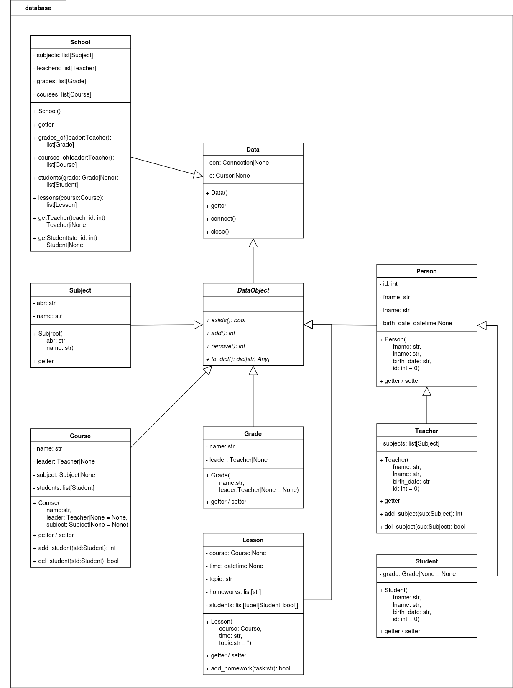

Paket: database
################

.. autofunction:: database.indb

UML-Klassendiagramm
====================

Module: data
=============

.. autoclass:: database.Data
    :members:

.. autoclass:: database.DataObject
    :members:

Module: subject
================

.. autoclass:: database.Subject
    :members:

Module: school
==============

.. autoclass:: database.School
    :members: